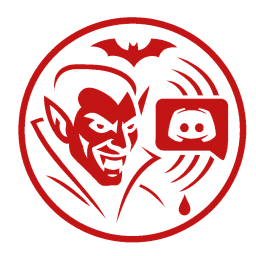

# VampireWebhook - Simple Discord webhook integration

## Features

- Loads webhook from hook.txt
- Allows mods to send messages to discord
- Format messages with markdown syntax

## For admins and server owners:

To properly setup this mod you need to:

- Create a `hook.txt` file in `\BepInEx\config\`
- Go to your discord and [get you webhook Url](https://support.discord.com/hc/en-us/articles/228383668-Intro-to-Webhooks) in the channel you want messages sent to.
- Add the webhook url to hook.txt
- ‼️NOTE: Do not share the webhook url with anyone. Don't post it when asking for support either.
- Add the `VampireWebhook.dll` to `\BepInEx\plugins\`
- You're good to go!

## Setttings

The settings file will be created at: `BepInEx\config\phlebotomist.morphine.VampireWebhook.cfg`
Set the value to `false` if you need to turn off the webhook for some reason.

```ini
[General]

## toggle for sending messages to the webhook
# Setting type: Boolean
# Default value: true
UseDiscordWebhook = true
```

## For devs:

The code is pretty short and I added doc comments above all functions but here's a quick overview of how it's intended to be used.

`SendDiscordMessageAsync` can be used to send the messages. `HookEnabled` is public so you can short circuit any proccessing or string building if the hook is turned off, however it is not required.

```csharp
using VampireWebhook;

private static void exmapleMessageBuilder(int someNumber){
    if (!HookEnabled())
        return;

    string myString = $"Wow it's over: {someNumber}!"
    _ = DiscordWebhook.SendDiscordMessageAsync(myString)

}
```

## credits and thanks:

Want to give thanks to Deca, Odjit and everyone in the VrisingModing discord who helped answer questions.

## Support:

- I go by `Morphine` on the Vrising modding [Modding VRising Mod ](https://vrisingmods.com/discord)
- Additionally feel free to open issues on the github

## Pull Requests:

I want to keep this thing simple but if there's anything you think I missed or did stupid I will try to review any PR's in a timely manner. Feel free to msg me on [Discord](https://vrisingmods.com/discord) (@morphine) if I don't respond within a day.
